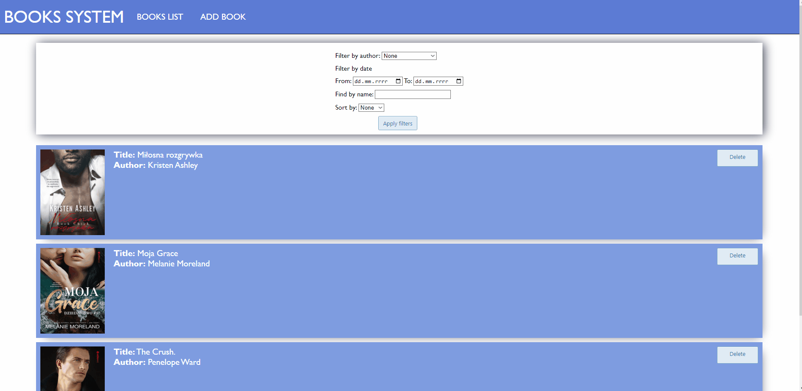
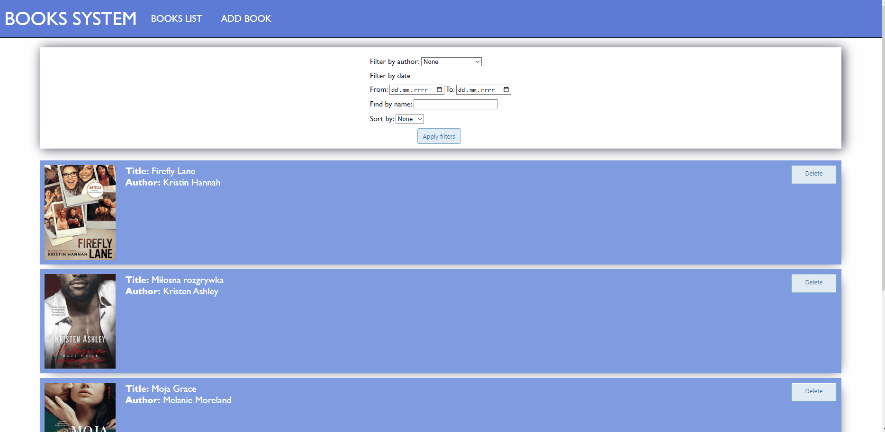
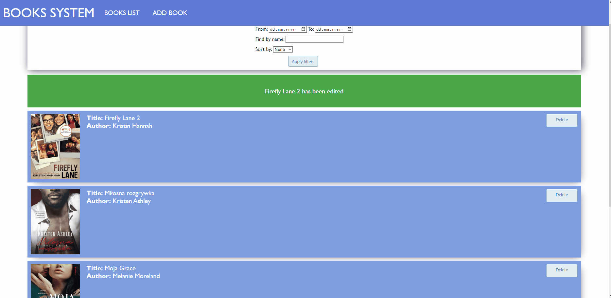

# BOOKS SYSTEM

## SPIS TREŚCI

- [URUCHOMIENIE PROJEKTU](#uruchomienie-projektu)
- [UŻYTE TECHNOLOGIE / BIBLIOTEKI](#użyte-technologie-/-biblioteki)
- [FUNKCJONALNOŚCI](#funkcjonalności)
- [STATUS PROJEKTU](#status-projektu)
- [ZRZUTY EKRANU](#zrzuty-ekranu)

## URUCHOMIENIE PROJEKTU

Projekt można uruchomić za pomocą dockera. W tym celu należy znaleźć się w folderze z projektem i wpisać polecenie:

```
docker compose up --build
```

Spowoduje to uruchomienie api, frontendu oraz bazy mongoDB (bez persystencji). Z projektu udostępniony został jednynie frontend pod portem 8080.

## UŻYTE TECHNOLOGIE / BLIBLOTEKI

Frontend:

- scss
- flask
- requests
- datetime
- re
- wtforms

Api:

- flask
- pymongo
- bson
- json

## FUNKCJONALNOŚCI

- Strona główna wyświetlająca całą listę książek (wraz z kilkoma informacjami oraz okładką)
- Kazdą książkę można usunąć
- Na stronie znajduje się header podążający za użytkownikiem
- Na stronie znajduje się footer wraz z linkami
- Po kliknięciu w daną książkę zostaje wyświetlony widok szczegółowy danej książki
- Z poziomu widoku szczegółowego możemy edytować informacje o wybranej książce
- Z poziomu paska nawigacji możemy przenieść się do formularza slużącego do dodania książki
- Wszystkie pola w formularzach są odpowiednio walidowane
- Na liście książek znajduję się formularz służący do filtrowania oraz sortowania książek (filtrować można po autorze, dacie oraz nazwie)
- Po odświeżeniu strony filtry oraz sortowanie zostają zachowane
- Po dodaniu / edycji książki zostają wyświetlone odpowiednie komunikaty

## STATUS PROJEKTU

Projekt zakończony: 31 lipca

## ZRZUTY EKRANU







